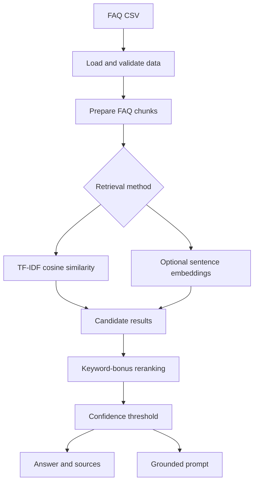

# Smart FAQ Retrieval System

FAQ search systems need to map user wording to the most relevant support answer. This project demonstrates a lightweight retrieval pipeline that selects candidate FAQ entries, reranks them with simple lexical overlap, and returns either the best grounded answer or a fallback message when confidence is low.

The project does not use an external LLM API, vector database, web service, or production dataset.

## Retrieval Pipeline



## Features

- Loads FAQ data from `data/raw/faqs.csv` when available.
- Falls back to the included `data/sample_faqs.csv` demo dataset.
- Validates required columns: `id`, `question`, `answer`, and `category`.
- Supports TF-IDF retrieval with cosine similarity.
- Supports optional semantic retrieval with `sentence-transformers`.
- Reranks retrieved candidates with the original keyword-overlap bonus.
- Builds grounded prompts from retrieved FAQ sources.
- Evaluates predicted FAQ source categories on built-in test questions.

## Repository Structure

```text
smart-faq-rag-search/
├── src/
│   └── smart_faq/
│       ├── __init__.py
│       ├── data_loader.py
│       ├── retrieval.py
│       ├── reranking.py
│       ├── prompting.py
│       ├── evaluation.py
│       └── main.py
├── tests/
├── data/
│   ├── raw/
│   │   └── .gitkeep
│   └── sample_faqs.csv
├── examples/
│   └── sample_queries.json
├── README.md
├── requirements.txt
├── .gitignore
├── LICENSE
└── pyproject.toml
```

## Installation

Create and activate a Python environment, then install the project:

```bash
python -m pip install -e .
```

For optional semantic retrieval:

```bash
python -m pip install -e ".[semantic]"
```

For tests:

```bash
python -m pip install -e ".[dev]"
```

You can also install from `requirements.txt`:

```bash
python -m pip install -r requirements.txt
python -m pip install -e .
```

## Usage

Run the default demo:

```bash
python -m smart_faq.main
```

Ask one question with TF-IDF retrieval:

```bash
python -m smart_faq.main --question "how do I reset my password?"
```

Run evaluation only as part of the CLI output:

```bash
python -m smart_faq.main --evaluate
```

Use a custom FAQ CSV:

```bash
python -m smart_faq.main --data-path data/raw/faqs.csv
```

Use semantic retrieval after installing the optional dependency:

```bash
python -m smart_faq.main --method semantic --question "how do I cancel my plan?"
```

## Data Format

FAQ CSV files must contain these columns:

```text
id,question,answer,category
```

Rows with missing or empty `question`, `answer`, or `category` values are rejected.

## Evaluation Methodology

The included evaluation uses three built-in test questions and checks whether the first returned source category matches the expected category. It reports a simple accuracy value and per-question predicted source. This is a sanity check for the demonstration dataset, not a benchmark.

Run tests:

```bash
pytest
```

## Current Limitations

- The included dataset is a tiny sample FAQ file.
- The answer is the selected FAQ answer, not generated text.
 
